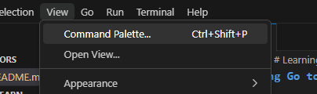
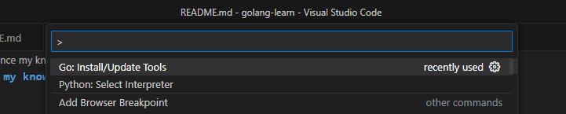
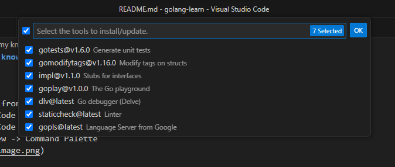

# Learning Go to enhance my knowledge

## Installing steps

* Download and install Go SDK from https://go.dev/dl/

* Install compatible IDE (VS Code or any other supported one) in this steps I used VS Code

* Install Go extention in VS Code extention library

* Update the Go tools from View -> Command Palette 

